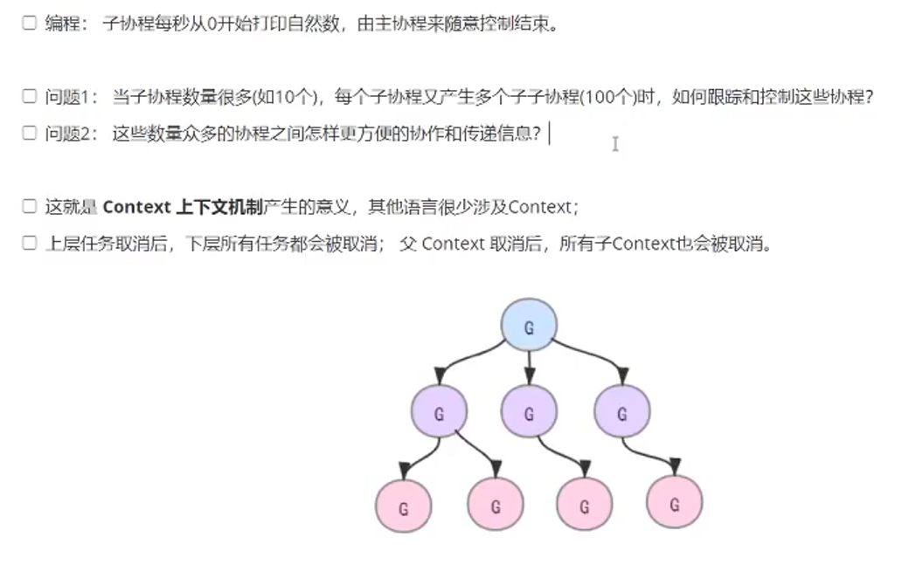

### Context
context 是一个非常重要的包，用于在 goroutine 之间传递上下文信息、取消信号、超时控制 



```go
type Context interface {
    // Done 返回一个通道，当 context 被 cancel取消 或 timeout超时 时会关闭
    Done() <-chan struct{}
    
    // Err 返回 context 为什么被取消的错误
    Err() error
    
    // Deadline 返回 context 的截止时间（如果设置了的话）
    Deadline() (deadline time.Time, ok bool)
    
    // Value 从 context 中获取键对应的值
    Value(key any) any
}
```

context常用的方法：
```go
// 创建可取消的 context
ctx, cancel := context.WithCancel(context.Background()) 
defer cancel()


// 创建 3 秒超时的 context
ctx, cancel := context.WithTimeout(context.Background(), 3*time.Second)
defer cancel() // 重要：释放资源


// 设置具体的截止时间：5秒后
deadline := time.Now().Add(5 * time.Second)
ctx, cancel := context.WithDeadline(context.Background(), deadline)
defer cancel()


// 创建带值的 context
ctx := context.WithValue(context.Background(), "userID", "12345")
ctx = context.WithValue(ctx, "requestID", "req-abc")
ctx = context.WithValue(ctx, "authToken", "token-xyz")
// 从 context 中获取值
if userID := ctx.Value("userID"); userID != nil {
    fmt.Printf("用户ID: %s\n", userID)
}
```
