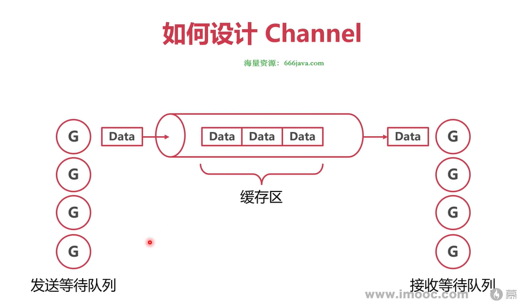

## 高并发下的通信：Channel 管道
### 无缓冲通道 VS 有缓冲通道
- 无缓冲 channel（make(chan T) 或者 make(chan T, 0)）：必须要发送方和接收方同时存在，才能完成一次传递。不然就会阻塞。
- 有缓冲 channel（make(chan T, N)，N>0）：最多能存 N 个值，发送方在缓冲区没满时不会阻塞，接收方在缓冲区没空时不会阻塞。

这是因为：**Go 的 channel 设计哲学就是零丢失，即只要写入成功，就保证消息一定会被某个接收方读出来**。不会像消息队列里那样默认有丢弃策略。

举例说明：
无缓冲 channel：这里没有中间存储空间，发送方和接收方必须在同一时刻握手。发送和接收是同步的、直接的，没有中转站
可以想象成“直接把球递到对方面前”：你手里拿着球（要写入的值），除非有人接球，否则你不能松手。

有缓冲 channel（容量 = n）：
这里有一个长度为 n 的小仓库。当仓库没满时，生产者随便放，不用管有没有人立刻取。
当放到第 n+1 个时，仓库没空间了，发送方就会被卡住，直到有消费者取走一个空出位置。

管道的理念：不要通过共享内存的方式进行通信，而要通过通信的方式共享内存

### Channel 数据结构

