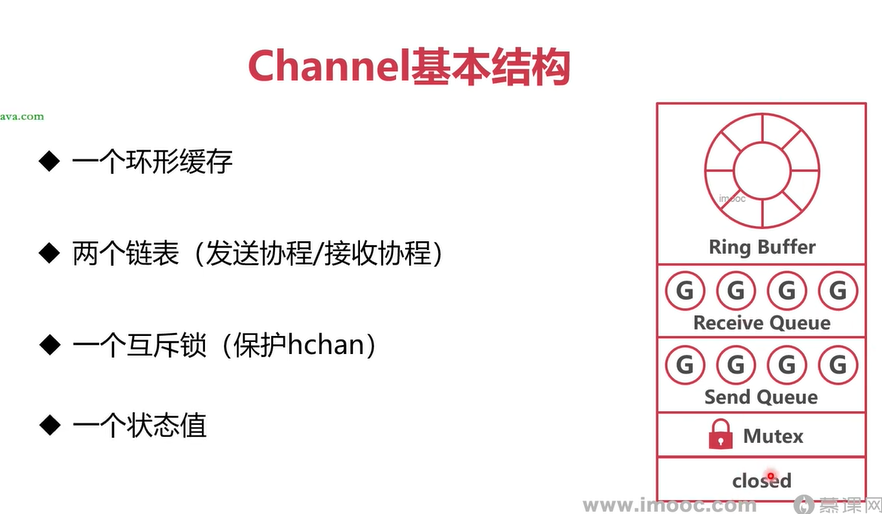

## 高并发下的通信：Channel 管道
### 无缓冲通道 VS 有缓冲通道
- 无缓冲 channel（make(chan T) 或者 make(chan T, 0)）：必须要发送方和接收方同时存在，才能完成一次传递。不然就会阻塞。
- 有缓冲 channel（make(chan T, N)，N>0）：最多能存 N 个值，发送方在缓冲区没满时不会阻塞，接收方在缓冲区没空时不会阻塞。

这是因为：**Go 的 channel 设计哲学就是零丢失，即只要写入成功，就保证消息一定会被某个接收方读出来**。不会像消息队列里那样默认有丢弃策略。

举例说明：
无缓冲 channel：这里没有中间存储空间，发送方和接收方必须在同一时刻握手。发送和接收是同步的、直接的，没有中转站
可以想象成“直接把球递到对方面前”：你手里拿着球（要写入的值），除非有人接球，否则你不能松手。

有缓冲 channel（容量 = n）：
这里有一个长度为 n 的小仓库。当仓库没满时，生产者随便放，不用管有没有人立刻取。
当放到第 n+1 个时，仓库没空间了，发送方就会被卡住，直到有消费者取走一个空出位置。

管道的理念：不要通过共享内存的方式进行通信，而要通过通信的方式共享内存


### Channel 数据结构

设计思路：
- 需要有一个缓冲区，用来存放已发送的数据
- 需要一个发送等待队列，如果是无缓冲通道或者有缓冲通道但是缓冲区满了之后，发送的协程需要被挂起
- 需要一个接收等待队列，如果是无缓冲通道或者有缓冲通道但是缓冲区没有数据的时候，接收协程需要被挂起

```go
type hchan struct {
	qcount   uint           // total data in the queue
	dataqsiz uint           // size of the circular queue
	buf      unsafe.Pointer // points to an array of dataqsiz elements
	elemsize uint16
	synctest bool // true if created in a synctest bubble
	timer    *timer // timer feeding this chan
	elemtype *_type // element type

    closed   uint32     // 0表示开启，1表示关闭

	recvx    uint   // receive index
	recvq    waitq  // list of recv waiters     接收队列

    sendx    uint   // send index
	sendq    waitq  // list of send waiters     发送队列

	lock mutex
}
```


总的来说，channel的数据结构如下：


### Channel 发送数据
发送数据的三种情况：
1. 直接发送
    说明此时缓冲区没有数据，并且接收队列中有协程在等待
    直接把数据发送给正在等待的协程即可
2. 放入缓存
    说明此时接收队列中没有协程在等待，并且缓冲区还有位置
    直接把数据放到缓存区
3. 休眠等待
    说明此时接收队列中没有协程在等待，并且缓冲区已经满了或者没有缓冲区
    就把这个发送的协程放入发送队列中等待


总结


### Channel 接收数据
接收数据有四种情况：
1. 有等待发送的协程，直接从发送协程中获取
    说明这个Channel没有缓存区，并且发送队列中有协程在等待了
    直接从等待协程中获取数据
2. 有等待发送的协程，直接缓存中获取
    说明这个Channel缓存区已经满了，并且发送队列中有协程在等待了
    直接从缓存区中取走一个数据，并且把位于发送等待队列中休眠的协程唤醒
3. 从缓存中接收
    说明此时Channel的缓存区中有数据，并且发送队列中没有协程在等待
    直接从缓存区中取走数据即可
4. 休眠等待
    说明此时缓存区中没有数据或者没有这个Channel本身就没有缓冲区，并且发送队列中没有等待的协程
    把这个放入接收队列中进行休眠等待


总结


### 非阻塞的 Channel

