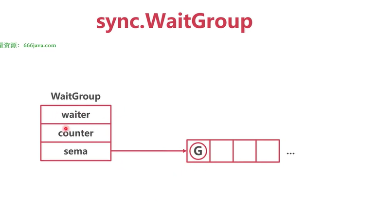
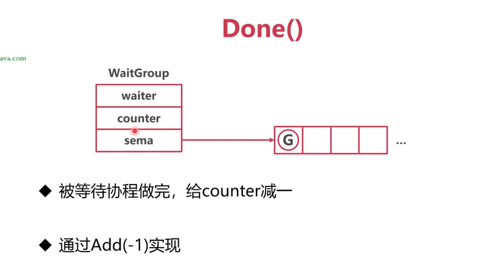

## 锁 lock
### atomic操作
- 原子操作是一种硬件层面的加锁机制
- 保证操作一个变量的时候，其他协程/线程无法访问
- 只能用于简单变量的简单操作，比如int这类可以，结构体则不行了

### sema锁 / 信号量锁
- 核心是一个 uint32 值，含义是同时可并发的数量
- 每个 sema锁 都对应一个 SemaRoot结构体
- 每个 SemaRoot结构体 中有一个平衡二叉树，用于协程排队


uint32 == 0
获取锁：协程休眠，进入堆树等待
释放锁：从堆树中取出一个协程，唤醒

### 互斥锁 sync.Mutex
数据结构


#### 正常模式下（starving == 0），加锁的操作
- 尝试CAS直接加锁
- 若无法直接获取，进行多次自旋尝试
- 多次失败之后，进入 sema队列 休眠

有两个协程竞争一把锁，想要把Locked字段由0转为1


肯定有一个协程成功获取到锁，那么另外那个协程就没有获取到锁。获取失败的那个协程就会自旋等待


自旋等待一段时间之后，还是无法获取到锁的话，那么就会去尝试获取sema。但是由于sema == 0，此时就像等于一个等待队列，就会把这个协程挂载到等待队列中。


如果后面再来一个协程想要获取这个锁，也还是会自旋等待


自旋失败之后，那么就会去尝试获取sema。但是由于sema == 0，就会把这个协程挂载到等待队列中。


#### 正常模式下（starving == 0），解锁的操作
- 尝试CAS直接解锁
- 若发现有协程再sema中休眠，唤醒一个协程

协程释放锁，将Locked置为0，并且由该协程从sema等待队列中唤醒一个正在等待的协程。


释放出来的协程不是一定能直接抢到这个锁，有可能它放出来的时候又有很多协程在等待了，此时又是需要重新抢占锁了


#### 锁饥饿
场景：
协程A占据了互斥锁，协程B、协程C在sema队列中等待。
当协程A释放了互斥锁，调度器会唤醒协程B，但是协程B不一定里面就能获取到互斥锁，因为协程B唤醒的时候，有可能已经存在了协程D、协程E在自旋等待了。
这个时候协程B、协程D、协程E又要开始一轮互斥锁的争夺了。
在这个过程中，可能协程B又没有抢到，又被放到sema队列中去了。
这样就会造成某个协程一直抢不到锁，就造成了锁饥饿的问题。

#### Mutex饥饿模式
- 当前协程等待锁的时间超过了10ms，切换到饥饿模式
- 饥饿模式中，新来的协程不自旋，直接进入 sema队列 休眠
- 饥饿模式中，从sema队列中被唤醒的协程直接获取锁
- 如果sema队列中等待的协程数量为0，回到正常模式

锁竞争严重时，互斥锁进入饥饿模式。饥饿模式没有自旋等待，不会存在空转消耗性能的情况
同时，从sema队列中取出的协程直接获取锁，有利于公平，防止出现某个协程一直获取不到锁的情况


### 读写锁 sync.RWMutex


#### 总结
- 用 Mutex 实现写协程之间的互斥等待
- 读协程使用readerSem等待写锁的释放，也就是说如果已经加了写锁，那么读协程就会被放到readerSem里面等待
- 写协程使用writerSem等待读锁的释放，也就是说如果已经加了读锁，那么写协程就会被放到writerSem里面等待
- readerCount记录读协程的个数
- readerWait记录写协程前面的读协程的个数

- 如果是读多写少的场景，使用 读写锁RWMutex 能提高性能
- 如果是写多读少的场景，那么直接使用 互斥锁Mutex


### WaitGroup



1. counter（计数器）
- 记录还有多少个任务没完成。
- Add(n) 会增加，Done() 会减少。
- 当 counter == 0 时，表示所有任务完成。

2. waiter count（等待者个数）
- 记录有多少个 goroutine 调用了 Wait()，也就是有多少个“等候的人”。
- 如果有多个 goroutine 调用了 Wait()，当计数器归零时，它们都要被唤醒。

3. sema（信号量）
- 把等的人挂起，等 counter 归零时把他们叫醒。，也就是真正用来挂起/唤醒等待的 goroutine。

```go
func () test(waitGroup *sync.WaitGroup) {
	waitGroup.Done()
}

func main() {

	waitGroup := sync.WaitGroup{}

	waitGroup.Add(3)
	go test()
    go test()
    go test()

	waitGroup.Wait()                    // main goroutine 就会被 阻塞，挂在 WaitGroup 内部的 sema 上，进入“等待模式”
}
```
分析：
当 main 执行到 waitGroup.Wait() 时，发现计数器（counter）还没归零（初始值 3）。
这时候，main goroutine 就会被 阻塞，挂在 WaitGroup 内部的 sema 上，进入“等待模式”。
等到 3 个 Done() 调用完毕，counter 变成 0，runtime 就会通过 runtime_Semrelease 把阻塞在 sema 上的 main goroutine 唤醒，它才会继续往下执行（退出程序）。





#### 总结
- WaitGroup 实现了一组协程等待另外一组协程
- 等待的协程（ 也就是调用了 waitGroup.Wait() 的协程 ）被放入Sema等待队列，并且记录等待的个数counter
- 当等待协程计数counter归零的时候，调度器会唤醒所有在sema中等待的协程


### sync.Once
- sync.Once实现了一段代码只执行一次
- 使用标志位 + mutex实现了并发冲突的优化

- 先判断标志位是否已经改值
- 如果还有更改，尝试获取锁
- 获取到锁的协程执行业务，改标志位的值，然后解锁
- 由于要求代码只需要执行一次，因此当等待的协程被唤醒，然后直接返回