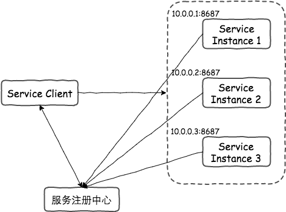

## go-zero 快速入门

### 安装与环境配置
1. goctl
goctl 是 go-zero框架 的内置脚手架，可以一键生成代码、文档、部署k8s yaml、dockerfile等

```
go install github.com/zeromicro/go-zero/tools/goctl@latest
goctl --version
```

go get 仅下载代码并更新 go.mod，不再安装二进制文件。
go install 会直接将二进制文件安装到 GOPATH/bin。安装二进制工具需要使用 go install


2. protoc
- protobuf 是一种序列化/反序列化的标准，类似于json、xml
- protoc命令行是protobuf的编译器，将 .proto 文件编译成对应的开发语言文件
- protoc-gen-go 是protoc的一个插件，用于生成go语言代码
- protoc-gen-go-grpc是protoc的go grpc的插件，可以生成grpc相关的go语言文件

打开https://github.com/protocolbuffers/protobuf/releases
下载对应的版本（我这里是windows电脑），下载 https://github.com/protocolbuffers/protobuf/releases/download/v28.0/protoc-28.0-win64.zip
解压，并设置环境变量即可  protoc --version

```
go install google.golang.org/protobuf/cmd/protoc-gen-go@latest
go install google.golang.org/grpc/cmd/protoc-gen-go-grpc@latest
```

3. IDEA插件
- goctl


### 创建 demo
1. 创建步骤
```
cd 03_go-zero               
goctl api new demo_01       // 使用脚手架创建模板代码
cd demo_01
go mod tidy                 // 下载依赖
```

2. 目录说明
```
example                             // example：单个服务目录，一般是某微服务名称
├── etc                             // etc：静态配置文件目录
│   └── example.yaml
├── main.go                         // main.go：程序启动入口文件
└── internal                        // internal：单个服务内部文件，其可见范围仅限当前服务
    ├── config                      // config：静态配置文件对应的结构体声明目录
    │   └── config.go
    ├── handler                     // handler：handler 目录，可选，一般 http 服务会有这一层做路由管理，handler 为固定后缀
    │   ├── xxxhandler.go
    │   └── xxxhandler.go
    ├── logic                       // logic：业务目录，所有业务编码文件都存放在这个目录下面，logic 为固定后缀
    │   └── xxxlogic.go
    ├── svc                         // svc：依赖注入目录，所有 logic 层需要用到的依赖都要在这里进行显式注入
    │   └── servicecontext.go
    └── types                       // types：结构体存放目录
        └── types.go
```

3. 修改 demo_01.api
不要直接修改 types 目录下的内容，这是 goctl 自动生成的
修改 demo_01.api 之后，重新生成文件

goctl api go --api demo_01.api --dir .

--api：指定api文件
--dir：指定go文件生成的目录


### 配置文件
在生成的代码中，配置文件位于etc目录下，格式为yaml。go-zero支持多种配置文件格式：yml、yaml、toml、json


在部署时，**配置文件并不会打包到二进制包中**，我们需要指定配置文件，通过命令行参数的形式指定
```
# 执行文件 -f etc/hello01-api.json
go run main.go -f etc/hello01-api.json
```


## grpc 快速入门
微服务之间通信的方式为RPC
在Golang的体系中，gRPC是使用最广的RPC框架。
gRPC基于HTTP/2.0，采用Protobuf作为数据序列化协议，并且具有语言中立的特点
go-zero框架对GRPC已经支持，可以轻松的开发gRPC应用

### proto 文件
```
syntax = "proto3";                          // 指定正在使用proto3语法

message SearchRequest {                     // 消息类型 用于传输的数据格式的定义
  string query = 1;                         // 每个字段必须指定字段编号： 1到536870911之间的一个数字，需要唯一，19000到19999是保留编号不能使用
  int32 page_number = 2;
  int32 results_per_page = 3;
}
message SearchResponse{}

import "myproject/other_protos.proto";      // 可以导入其他proto文件 使用其他proto文件定义的消息

package foo.bar                             // 包定义 防止消息类型之间的名称冲突

service SearchService {                                     // 定义RPC服务接口 
  rpc Search(SearchRequest) returns (SearchResponse);
}
```

注意：
需要对外提供 HTTP API（如移动端/网页调用）→ .api 文件。
需要高性能 内部服务通信（如微服务间调用）→ .proto 文件。


### grpc 案例
rpc分为server端和client端：
- server端提供rpc服务，为服务提供方
- client端为服务消费方
- RPC框架的目的是让远程调用变得和本地调用一样方便

1. server端
```shell
cd 03_go-zero/demo_04
goctl rpc -o greet.proto                                                                                         # 生成 proto文件 模板
goctl rpc protoc greet.proto --go_out=./grpc_server  --go-grpc_out=./grpc_server  --zrpc_out=./grpc_server       # 生成 gRPC服务端
go mod tidy                                                                                                      # 拉取依赖
```

- go_out: proto生成的go代码所在的目录，proto本身的命令参数
- go-grpc_out：proto生成的grpc代码所在的目录，proto本身的命令参数，和go_out必须同一个目录
- zrpc_out： goctl rpc自带的命令，go-zero生成的代码所在的目录

生成的模板代码结构如下：
```
D:.
│  main.go                          # 程序入口。加载配置文件；初始化依赖资源（svc.ServiceContext）；注册 gRPC 服务（server.RegisterGreetServer）
├─etc
│      config.yaml                  # 配置文件
|
├─greet                             # Proto 生成文件
│      greet.pb.go                  # proto 生成的 Go 结构定义。包含 Proto 文件中定义的 消息结构体（如 PingRequest/PingResponse）
│      greet_grpc.pb.go             # gRPC 服务端/客户端接口代码。包含 gRPC 服务接口定义（如 GreetServer 接口）
|
├─greetclient                       # 客户端调用封装。封装客户端调用逻辑，方便其他服务调用当前 gRPC 服务。
│      greet.go                     # 提供如 NewGreetClient 方法，返回一个预配置的 gRPC 客户端实例。
|
└─internal
    ├─config                        # 配置结构体定义
    │      config.go                # 与 config.yaml 映射，通过 conf.MustLoad 加载。               
    |
    ├─logic                         # 业务逻辑实现。
    │      pinglogic.go             # 实现具体的 RPC 方法（如 Ping）
    |
    ├─server                        # gRPC 服务注册与实现。
    │      greetserver.go           # 服务注册层：将 GreetServer 接口与 logic 实现绑定。
    └─svc
            servicecontext.go       # 依赖资源上下文
```

启动服务：main.go → 读取配置 → 初始化 ServiceContext → 注册 gRPC 服务。
处理请求：客户端调用 Ping → greetserver.go 接收请求 → 转发到 pinglogic.go → 返回响应。

详细介绍：
greet/ 目录               Proto 生成的共用代码，包含：
1. 消息结构体（如 PingRequest、PingResponse，在 greet.pb.go 中定义）。
2. gRPC 服务接口（如 GreetServer 接口，在 greet_grpc.pb.go 中定义）。

greet/目录下的内容既用于 Server 端（实现接口），也用于 Client 端（调用接口）。是 Server 和 Client 的 共享依赖，不属于单一端。

greetclient/ 目录         Client 端封装
这是可选的客户端辅助代码，通常由 goctl 生成，用于 简化 Client 调用。
即使没有这个目录，Client 端也可以通过 greet_grpc.pb.go 中的生成的客户端代码直接调用服务。
它的存在只是为了 代码复用和调用方便，并非 Client 端的必需部分。


3. 配置文件说明
在使用gRPC服务时，我们会用到go-zero内置的 RpcClientConf配置 和 RpcServerConf配置

RpcSeverConf：
  ServiceConf: 基础服务配置
  ListenOn: 监听地址
  Etcd: etcd 配置项
  Auth: 是否开启 Auth
  Redis: rpc 认证，仅当 Auth 为 true 生效
  Timeout: 超时时间
  Middlewares: 启用中间件
  Health: 是否开启健康检查

RpcClientConf：
  Etcd: 服务发现配置，当需要使用 etcd 做服务发现时配置
  Endpoints: RPC Server 地址列表，用于直连，当需要直连 rpc server 集群时配置
  Target: 域名解析地址，名称规则请参考
  App: rpc 认证的 app 名称，仅当 rpc server 开启认证时配置
  Token: rpc 认证的 token，仅当 rpc server 开启认证时配置
  NonBlock: 是否阻塞模式,当值为 true 时，不会阻塞 rpc 链接
  Timeout: 超时时间
  KeepaliveTime: 保活时间
  Middlewares: 是否启用中间件

4. 使用 Etcd

注册中心是服务发现的核心，是包含服务实例数据(例如ip地址，端口等)的数据库。所以注册中心需要一个高可用的分布式键/值存储，例如Etcd，Zookeeper，Consul等。
server 端
```
Etcd:
  Hosts:
  - 127.0.0.1:2379
  Key: greet_rpc
```

client 端
```
Etcd:
  Hosts:
  - 127.0.0.1:2379
  Key: greet_rpc
```